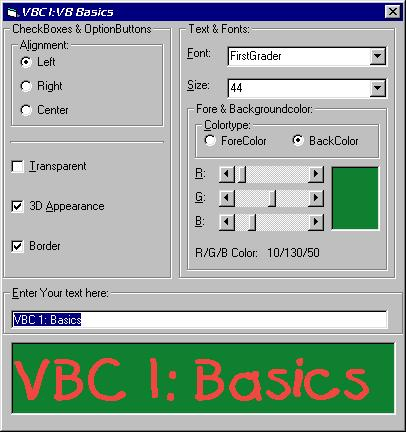



## VB Compendium for Beginners \(Part I\)

### Description

This code shows the basics of VB controls and some functions. It's for beginners and heavilly commented with some tipps & tricks! It's the first part of my huge VB Compendium. others will be soon on PSC!!!
 
### More Info
 

             |
---                |---
**Submitted On**   |2001-12-04 12:39:26
**By**             |[GammaRay](https://github.com/Planet-Source-Code/PSCIndex/blob/master/ByAuthor/gammaray.md)
**Level**          |Beginner
**User Rating**    |4.7 (14 globes from 3 users)
**Compatibility**  |VB 6\.0
**Category**       |[Coding Standards](https://github.com/Planet-Source-Code/PSCIndex/blob/master/ByCategory/coding-standards__1-43.md)
**World**          |[Visual Basic](https://github.com/Planet-Source-Code/PSCIndex/blob/master/ByWorld/visual-basic.md)
**Archive File**   |[VB\_Compend393281242001\.zip](https://github.com/Planet-Source-Code/gammaray-vb-compendium-for-beginners-part-i__1-29462/archive/master.zip)

